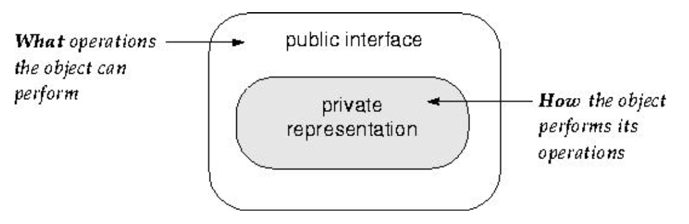

# Lecture 3 Information Hiding

## Software Design Principles

### Principle 1: Abstraction 抽象

在computer science中， 抽象就是用语义的形式描述数据和形式，隐藏其实现细节，包含操作抽象(procedural abstraction)和数据抽象(data abstraction)。

> 抽象仅包含当前视角下类型的相关信息。

- Procedural abstraction: " Name of procedure denotes the sequence of  actions."  任务的具体逻辑和实现细节对用户来说是隐藏的。
- Data abstraction: " Goal is to find the hierarchy in the data." 将多个细分的数据类型整合成一个复杂的数据类型。

### Principle 2: Modularity 模块化

Each object forms a separate entity whose internal workings are **decoupled** from other parts of the system.(每个对象都来源于一个单独的实体，它内部的工作与系统的其它部分是分离的。)

Key concepts:

- Cohesion: the glue that keeps a module together
- Coupling: the strength of the connection between modules

### Principle 3: Information Hiding 信息隐藏

"Breaking a program into modules and <u>what are likely to change independently should be secrets of seperate modules.</u>" 代码模块的内部结构应该是外部不可见的。

> Interface 定义稳定的部分(stable aspects), implementations 定义可变的部分(changeable adpects).

- 给每一个module一个interface，只显示稳定不变的部分，隐藏kebiandebufen
- client只依赖于稳定的interface，而不是implementation

