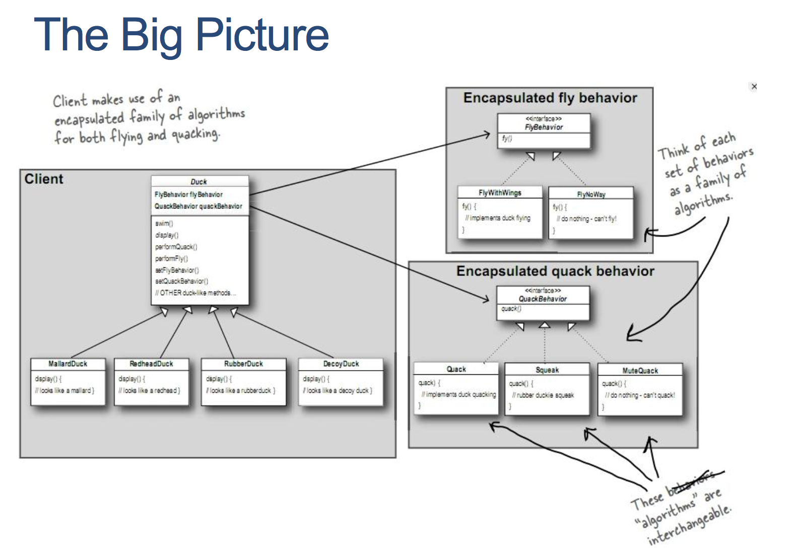
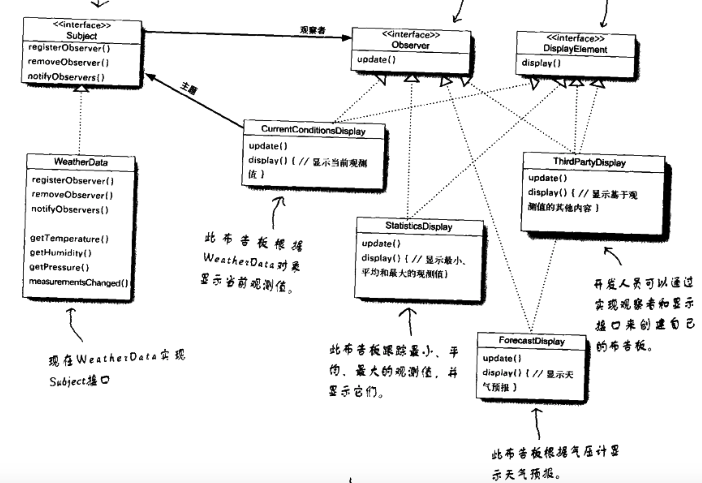
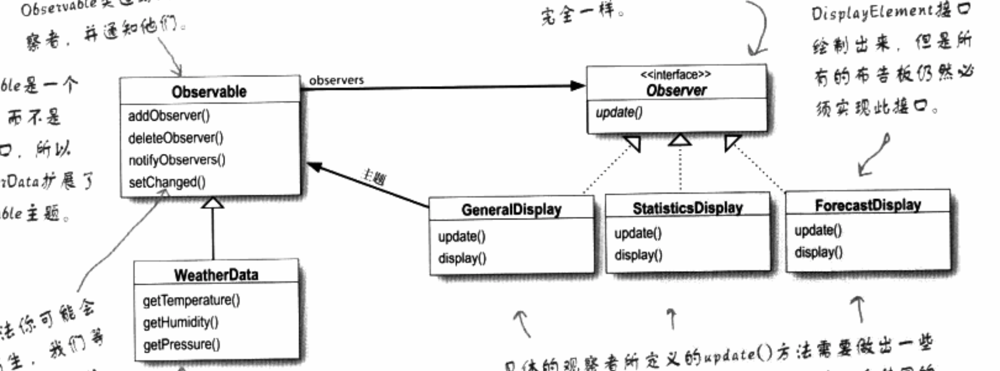
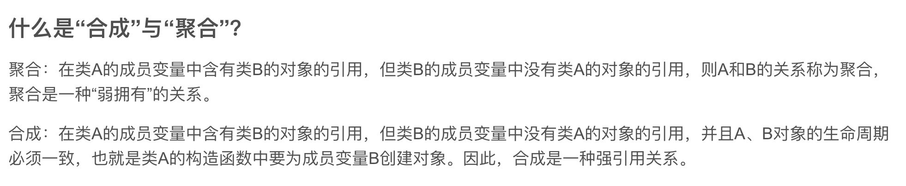

# Design pattern 

### 1 Strategy Pattern

> - "Gang of Four " ==> 4 authors of the book *Design Patterns: Elements of Reusable Object-Oriented Software*

:blush:Design Principles —— Indentify the aspects of your application that vary and seperate them from what stays the same.

- Encapsulate what varies
- Program to an interface, not to an implementation
- Favor composition over inheritance

:wink:Liskov Substitution Principle —— Let q(x) be a property provable about objects x of type T. Then q(y) should be provable for objects y of type S where S is a subtype of T.

---

SimUDuck Example:

- Different ducks **extends** Duck;

- Duck **has-a** FlyBehavior and QuackBehavior;
- Specific behaviors **implements** FlyBehavior and QuackBehavior.

### 2 Observer Pattern

vs. java 内置的观察者模式

---

### 9 Bridge Pattern 桥接模式

> 将两个继承体系聚合/组合连接在一起，这就是桥接模式。 

---

### 10 Flyweight Pattern 享元模式

当对象太多时，会导致性能下降cost太高的问题。所以享元模式通过共享技术实现相同或相似对象的重用。

