## 重构方法汇总

> ***Some important idea:***
>
> - Name explains the purpose of the code.

1. extract method

Extract the codes which should be grouped together and form a method.

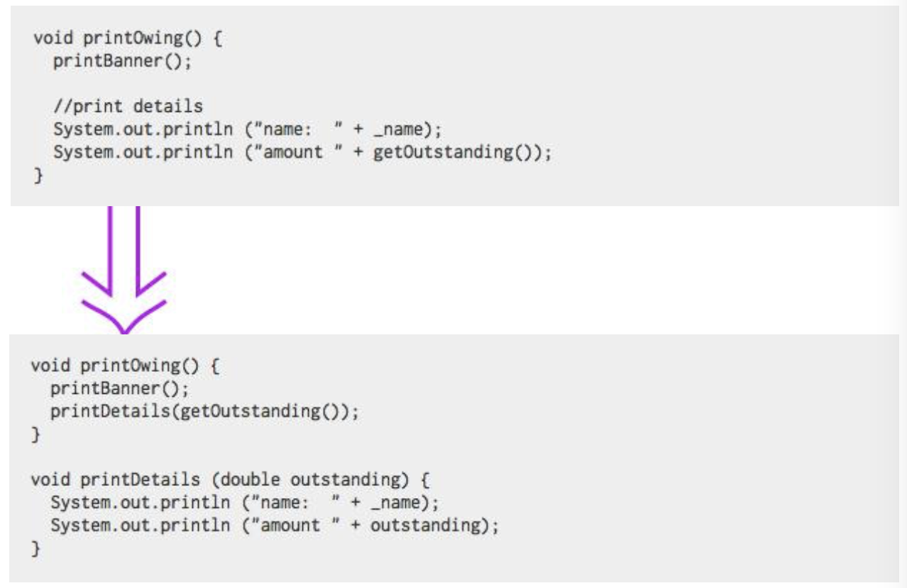

2. extract class

Extract fields, methods and form a class.

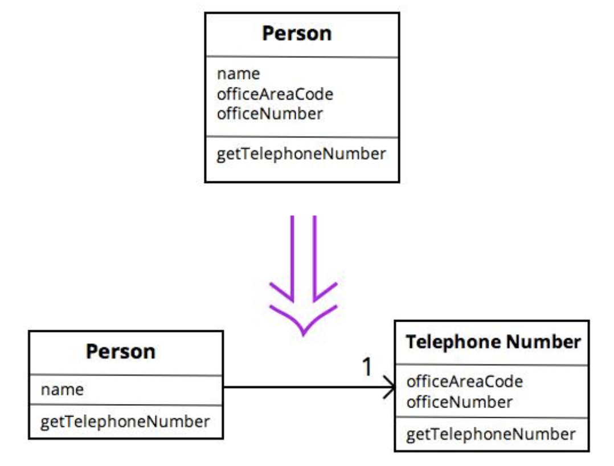

```java
//Good codes:
class Person {
private String name;
private TelephoneNumber officeTelephone = new TelephoneNumber();
public String getName() { 
    	return name;
	}
public String getTelephoneNumber() {
		return officeTelephone.getTelephoneNumber();
	}
}

class TelephoneNumber {
    private String number; 
    private String areacode;
    public String getTelephoneNumber(){
        return (“(“ + areacode + “) ” + number);
    }
}
```


3. Template method pattern

```java
public abstract class CaffeineBeverage {
    final void prepareRecipe() {  // ==> 模版方法
        boilWater();
        brew();
        pourInCup();
        addCondiments();
    }
    abstract void brew();  // ==> 抽象方法由子类完成不同的实现
    abstract void addCondiments();
    void boilWater() {
		System.out.println("Boiling water...");
    }
    void pourInCup() {
        System.out.println("Pouring into Cup...");
    }
}
```


4. Replace parameter with method

**Original version**:

```java
public double getPrice() {
    int basePrice = quantity * itemPrice;
    int discountLevel;
    if(quantity > 100) discountLevel = 2;
    else discountLevel = 1;
    double finalPrice = discountedPrice(basePrice, discountLevel);
    return finalPrice;
}
private double discountedPrice(int basePrice, int discountLevel) {
    if (discountLevel == 2) return basePrice * 0.1;
    else return basePrice * 0.05;
}
```

**Refactoring ==> replace parameter with method**:

```java
public double getPrice() {
    return discountedPrice();
}
public double discountedPrice() {
    if (getDiscountLevel() == 2) return getBasePrice() * 0.1;
    else return getBasePrice() * 0.05;
}
public int getDiscountLevel() {
    if(quantity > 100) return 2;
    else return 1;
}
public double getBasePrice() {
    return quantity * itemPrice;
}
```


5. Introduce parameter object

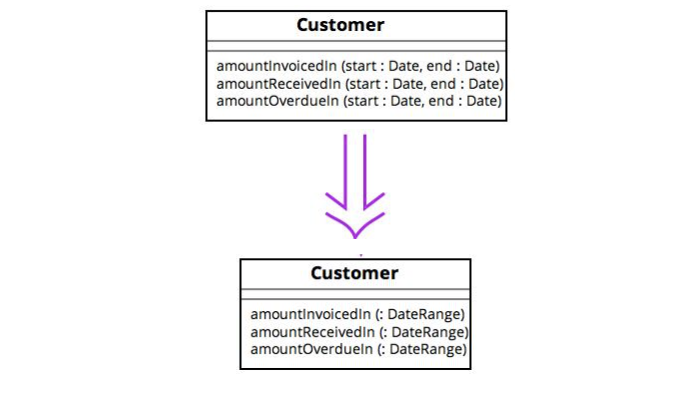

6. Preserve whole object

You get a bunch of values from an object but then pass those values together to another method call. 

:+1: Maybe you should just pass the whole object instead.

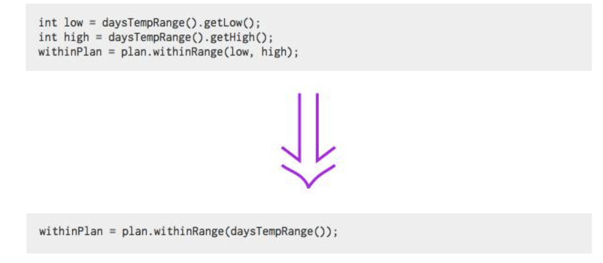


7. Move method

If the method is used by more features of another class, then move it. Turn the old method into a simple delegation or remove it altogether.

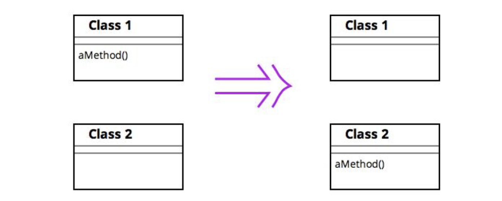

**Original version:**

```java
class Project {
    Person[] participants;
}
class Person {
    int id;
    boolean participate(Project p) {
        for (int i=0; i<p.participants.length; i++) {
            if (p.participants[i].id == id) return true;
        }
        return false;
    }
}
```

**Refactoring ==> move method:**

```java
class Project {
    Person[] participants;
    boolean participate(Person x) {
        for (int i=0; i<participants.length; i++) {
            if (participants[i].id == x.id) return true;
        }
        return false;
    }
}
class Person {
    int id;
}
```


8. Replace data value with object

You have a data item that needs additional data or behavior.

:+1: Turn the data item into an object.


9. Replace type code with class

Type code 类型码 就是用数字表示类型。

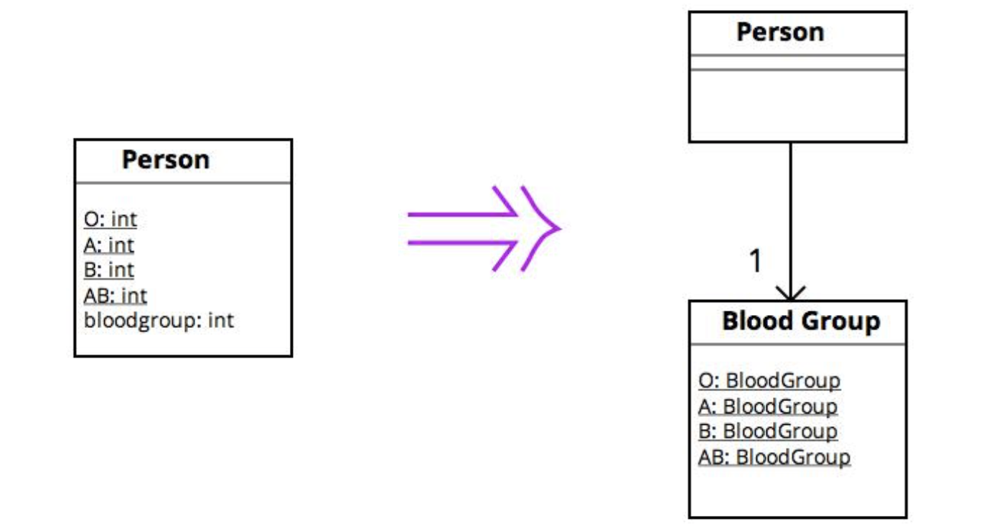


```java
//////////////////
```


10. Replace type code with strategy


```java
//////////
```


11. Replace conditional with polymorphism 

**Original version(use switch -- conditional)**:

```java
public class Employee {
    public int getPayAmount(){
        switch (getType()) {
            case EmployeeType.ENGINEER:
                return _monthlySalary;
            case EmployeeType.SALESMAN:
                return _monthlySalary + _commission;
            case EmployeeType.MANAGER:
                return _monthlySalary + _bonus;
            default:
                throw new RuntimeException("Incorrect Employee");
        } 
    }
}
```

**Refactoring ==> Replace conditional with polymorphism:**

```java
public class Employee {
    EmployeeType _type;
    public int getPayAmount() {
        return _type.payAmount();
    }
}
public abstract class EmployeeType {
    abstract int payAmount();
}
class Engineer extends Employee {
    int payAmount() {
        return xxxx;
    }
}
...
```


12. Collapse hierarchy 折叠继承体系

超类和子类之间无太大区别。将它们合为一体。

- 动机：

继承体系很容易变的过分复杂。所谓重构继承体系，往往是将函数和字段在体系中上下移动。完成这些动作后，很可能发现某个子类并未带来该有的价值，因此需要把超类与子类合并起来。

- 做法：

选择想移除的类，是超类还是子类。

使用push up field和push up method，或者push down method，push down field，移动数据和行为。

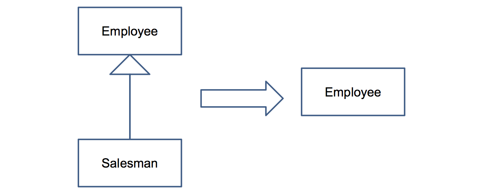


13. Inline class 内联类

某个类没有做太多事情。则**将这个类的所有特性搬移到另一个类中，然后移除原类**。

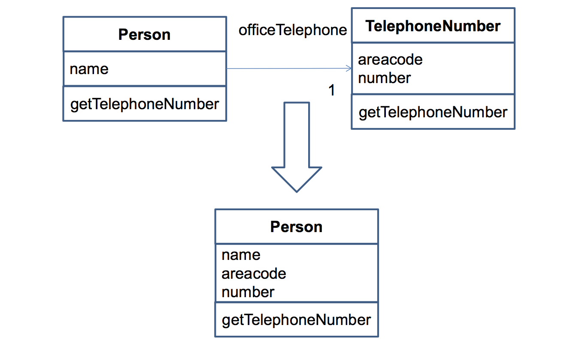

14. Introduce null object

Replace the null value with a null object.

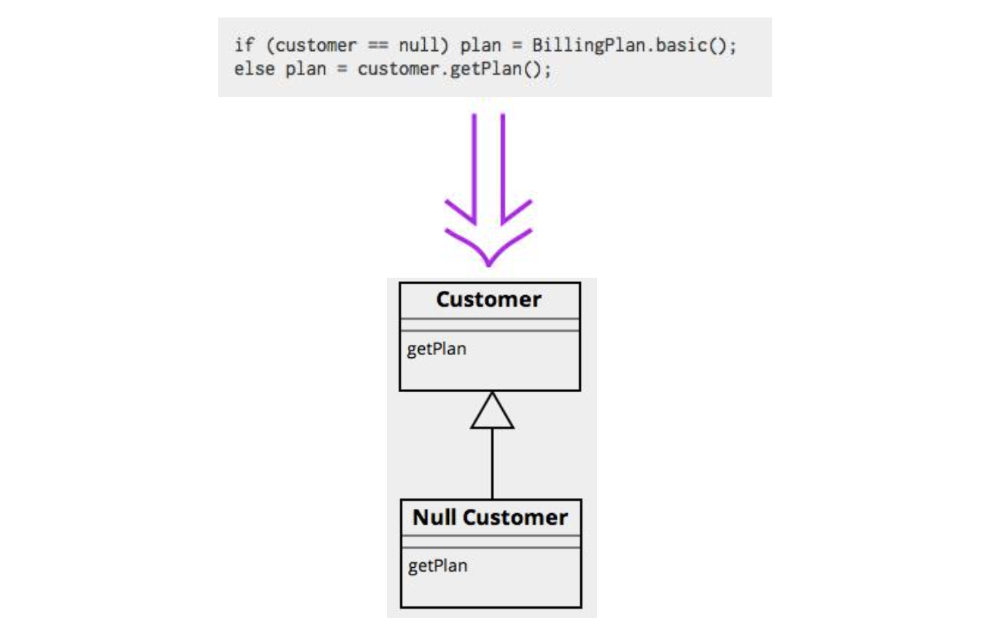

(详细介绍参照 [Introduce Null Object by Kanite](https://www.cnblogs.com/kanite/p/7679261.html) :+1:)


15. Hide delegate 隐藏委托关系

**Origin version**:

```java
class Person {
    Department _department;

    public Department getDepartment(){
        return _department;
    }

    public void setDepartment (Department arg){
        _department = arg;
    }
    
}

class Department{
    private String _chargeCode;
    private Person _manager;

    public Department (Person manager){
        _manager = manager;
    }

    public Person getManager{
        return _manager;
    }

}

```

那么

```java
 manager = john.getDepartment().getManager();
```


**Refactoring ==> hide delegate**:

```java
//服务类
class Person {
    Department _department;

    public Department getDepartment(){
        return _department;
    }

    public void setDepartment (Department arg){
        _department = arg;
    }
    //委托函数
    public Person getManager(){
    	return _department.getManager();
	}
}

//受托类：
class Department{
    private String _chargeCode;
    private Person _manager;

    public Department (Person manager){
        _manager = manager;
    }

    public Person getManager{
        return _manager;
    }

}


```

那么

```java
manager = john.getManager();
```

16. Remove middleman :question:

在“隐藏委托关系”中，谈到了“封装受托对象的好处”。但是这层封装是需要付出代价的：每当客户要使用受托类的新特性时，你就必须在服务器端添加一个简单委托函数。但是，随着受托类的特性越来越多，这一过程就会让你变得痛苦。这时，服务类完全变成了一个“中间人”，应该让客户直接调用受托类。

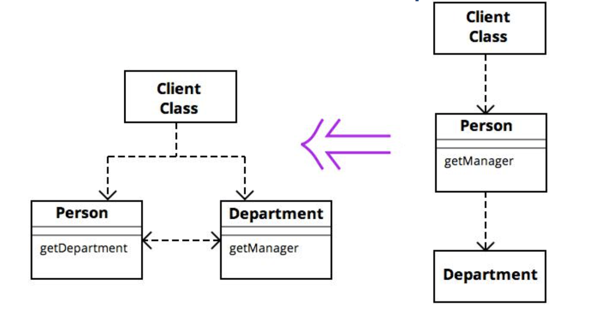

17. Inline method

A method’s body is just as clear as its name.

:+1: So put the method’s body into the body of its callers and remove the method.

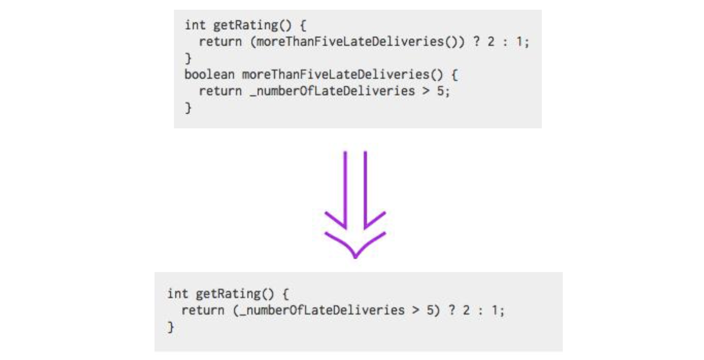

18. Change bidirectional association to unidirectional

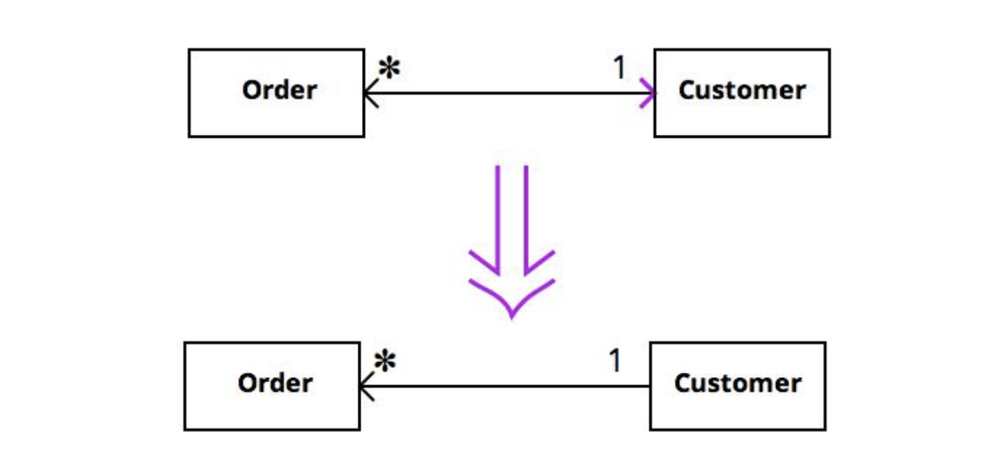

19. Encapsulate collection

class常常会使用群集(collection,可能是array,list,set或vector)来保存一组实体.这样的class通常也会提供针对该群集的getter/setter.

但是,集群的处理方式应该和其他种类的数据略有不同.取值函数(getter)不该返回群集自身,因为这将让用户得以修改群集内容而群集拥有者却一无所悉.这也会对用户暴露过多[对象内部数据结构]的信息.如果一个取值函数(getter)确实需要返回多个值,它应该避免用户直接操作对象内所保存的群集,并隐藏对象内[与用户无关]的数据结构.至于如何做到这一点,视你使用的Java版本不同而有所不同.

另外,不应该为这整个群集提供一个设值函数(setter),但应该提供用以为群集添加/移除(add/remove)元素的函数.这样,群集拥有者(对象)就可以控制群集元素的添加和移除.

如果你做到以上数点,群集(collection)就被很好地封装起来了,这便可以降低群集拥有者(class)和用户之间的耦合度.


20. Replace inheritance with delegation

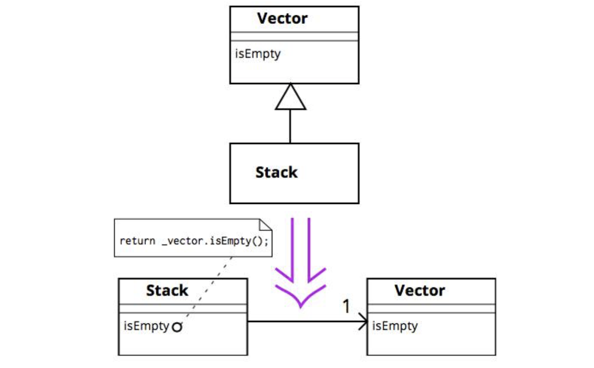


